# C Programming for Python Programmers

This training will cover:
1. Types, Operators, and Expressions
2. Branching and Iteration
3. Functions
4. Scope and Extent
5. Pointers
6. Arrays and Strings
7. Dynamic Memory
8. Structures
9. GDB
***

## Hello World

```
#include <stdio.h>

void main()
{
    printf("Hello World \n");
}
```

All C programs have main() as the entry-point function. The braces indicate the extent of the function block. When a function completes, the
program returns to the calling function. In the case of **main()**, the program terminates and control returns to the environment in which the program was executed. The integer return value of **main()** indicates the program’s exit status to the environment, with 0 meaning normal termination.

C is a free-form language, the program is not affected by whitespace in most cases. A statement is terminated by a semicolon and not a newline. 

## Variables and Types

C is a types language. Every variable in C is assigned a distinct type that dictates the range of values it can hold, the manner in which its data is stored in memory, and the permissible operations that can be performed on it. 

| Types         | Size (Bytes)      |
| ------------- | ----------------- |
| char          |       1           |
| int           |       4           |
| short int     |       2           |
| long int      |       8           |
| float         |       4           |
| double        |       8           |
| long double   |       16          |

All variables must be declared before they are used. They must be declared at the top of a block, a
section of code enclosed in brackets { and }, before any statements.

### Signed and Unsigned variables

A signed type can represent negative values (default option). The most-significant-bit (MSB) of the signed number is its sign-bit, and the value is typically encoded in 2’s-complement binary. An unsigned type is always non-negative, and the MSB is part of the numerical value—doubling the maximum
representable value compared to an equivalent signed type.

For example, a 16-bit signed short can represent the numbers −32768 to 32767 (−2 <sup>15</sup> to 2<sup>15</sup> − 1, one bit is used to denote the sign), while a 16-bit unsigned short can represent the numbers 0 to 65535 (0 to 2<sup>16</sup>−1)

## Operators

The syntax for arithmetic and relational operators in C are similar to python in almost all cases. The logical operators in C are as follows:

| Python         |      C           |
| ------------- | ----------------- |
| and           |       &&          |
| or            |       \|\|        |

## Branching

### if Condition
```
if condition:
    # body of if statement
```

```
if (condition) {
    # body of if statement
}
```

The main difference between an if statement in Python and C is that In C the condition should be enclosed in an opening  and closing parenthesis and the body should be enclosed in a opening and closing curly braces.

### if-else Ladder

```
if condition:
    # body of if statement
elif condition:
    # body of else-if statement
else:
    # body of else statement
```

```
if ( condition ) {
    # body of if statement 
}
else if ( condition ) {
    # body of else-if statement
}
else {
    # body of else statement
}
```

The applies to if-else ladder with the additional caveat that **elif** is replaced by **else if**. 

### Conditional expression

```
variable = (condition) ? Expression 1 : Expression 2;
```

Conditional expression is a construct available in C. If the condition is evaluated to true the first expression is evaluated if not the second expression is evaluated. 

### Switch Statement

```
switch(value) {

    case value1: case body
                 break;

    case value2: case body
                 break;

    case value1: case body
        break;

    default: case body
        break;
}
```

In **switch** statement the block whose value gets matched to the value passed to the switch command gets evaluated. The break statement after each case block is important or else all the statements after the qualifying case will also get evaluated. 

## Loops

In Python the loops can be used as an iterator through different data structures, while in C this is not possible. In C, loops are used as a control structure to manage statements that are repeated. This also means that in C the exit and entry to the loop body are based on an expression evaluation.

In addition, C also offers a **do-while** loop. While the **for** loop and **while** loop are entry controlled - the condition to enter the loop body is checked in the beginning of the loop execution. The do-wile loops is exit controlled - the condition to enter the loop body is checked at the end of loop execution. Which means that the loop is executed at least once. 

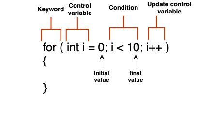

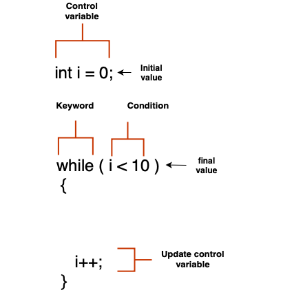

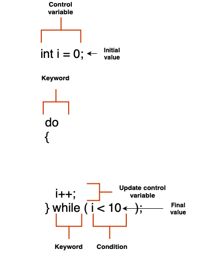

## Pointers

A pointer is a variable whose value is a memory address. 

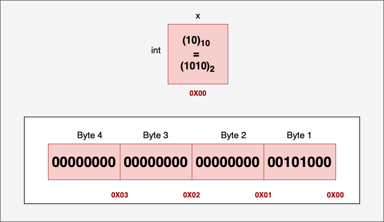

Let x be an integer variable defined and initialized to the value 10. 

```
int x = 10;
```

An integer take 4 bytes of memory. If we assume the first byte is stored in memory address 0X00 (0th bit) then the last byte will be stored in memory address 0X03 (23rd bit). A integer pointer can store the address of an integer variable.

```
int *ptr = &x;
```

As the address of the variable **x** starts with address 0X00, the pointer variable **ptr** will have the value 0X00. 

## Pointer Arithmetics

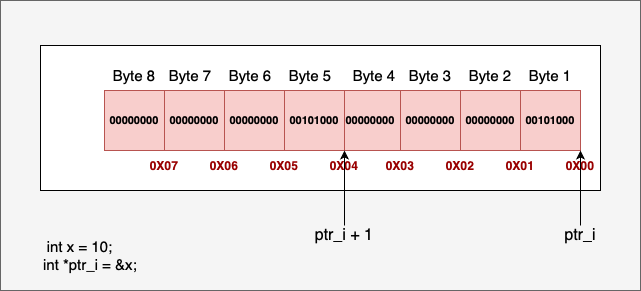

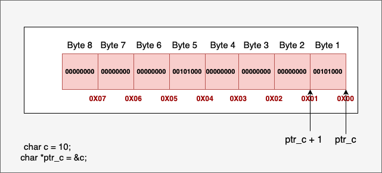


## Dynamic Memory

C has five distinct areas of memory: 

Text Segment: Once the program is compiled, it produces a binary file. This file is used to execute our program by loading it into RAM. Within this binary file are instructions, which are stored in the text segment of the memory. The text segment is allocated read-only permission to prevent inadvertent modifications to the program. 

Initialized data segment: The initialized data segment is the memory segment holds the values of external, global, static, and constant variables initialized at their declaration within the program. Given that variable values can alter during program execution, this memory segment is granted read-write permission. 

Uninitialized data segment: The uninitialized data segment, often referred to as BSS (Block Started by Symbol), is allocated memory upon program loading. All data within the BSS segment is initialized to arithmetic 0 and pointers to null by the kernel prior to program execution. This segment includes static and global variables initialized with arithmetic 0. Given that the values of variables stored in BSS can be altered, this data segment is granted read-write permissions.

Stack: This segment is used for storing local variables. When a local variable is defined, memory is allocated for it, and this memory is released promptly as the variable goes out of scope. The stack operates in a last-in-first-out (LIFO) queue. As variables are defined, they are "pushed onto the stack," increasing the stack's size. At the conclusion of a block, when multiple variables go out of scope simultaneously, they are destroyed, or "popped off the stack," in the reverse order of their allocation. Stack memory allocation is entirely managed by the compiler.

Heap:  The heap memory region is designated for dynamically allocated storage and is handled explicitly by the programmer, rather than the compiler. Requests for memory allocation and de-allocation are managed through a set of standard library functions, granting the programmer full control over the lifespan of allocated memory blocks. While heap-allocated memory offers flexibility and control, it also entails added responsibility on the part of the programmer. Unlike stack memory, the compiler does not verify the correct management of memory, making dynamic memory errors a common source of subtle runtime bugs.


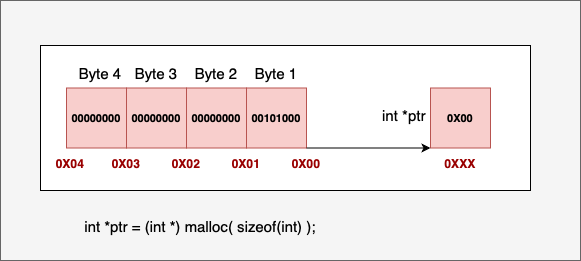

## Array


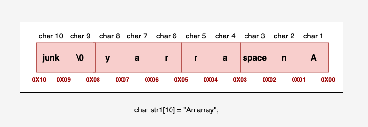

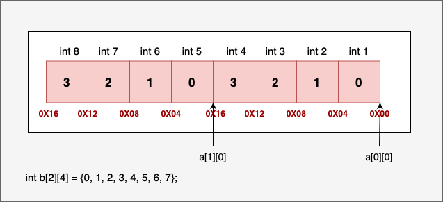

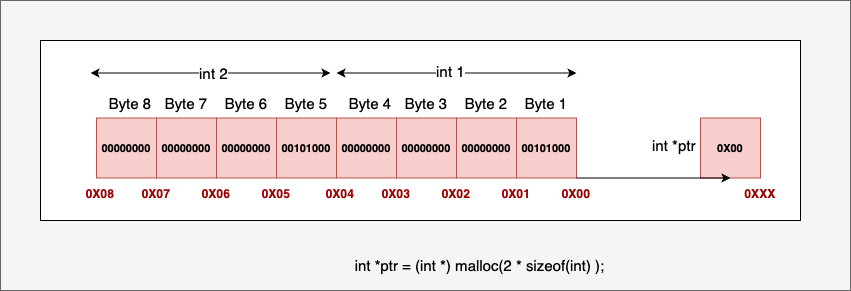

## Functions

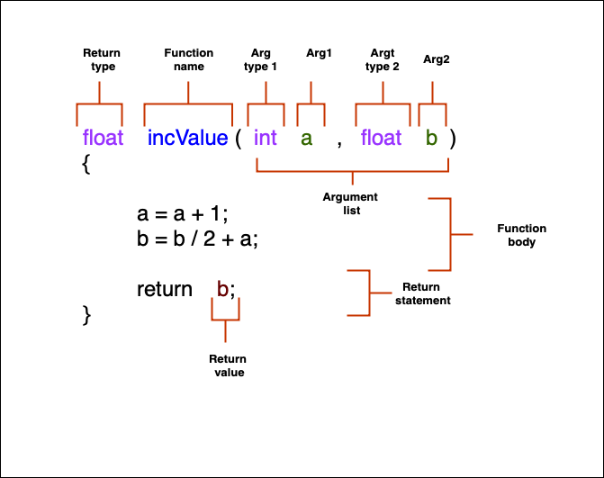

## Structure

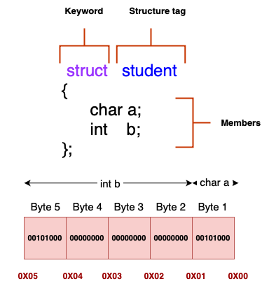

## Stages of Compiling


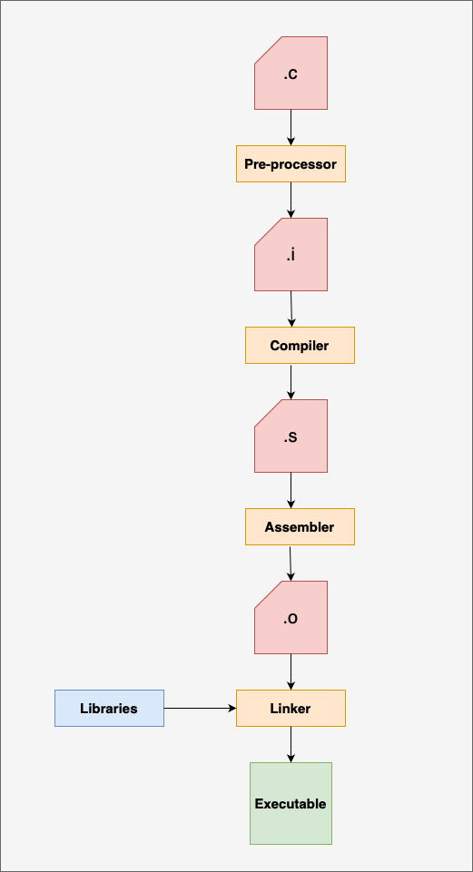

